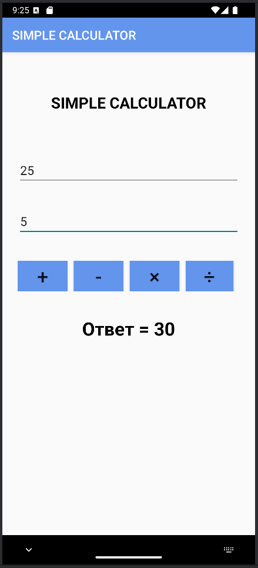
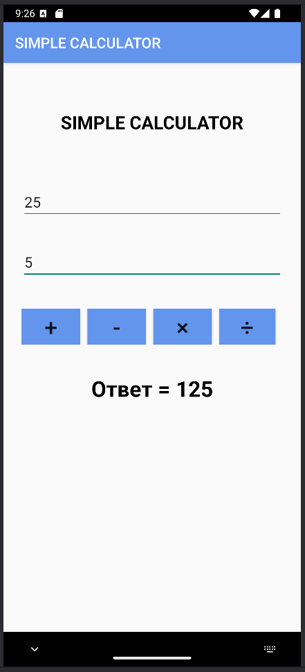
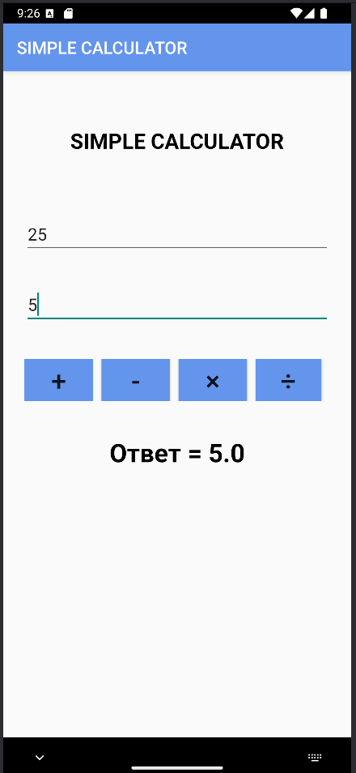

Программирование интернет - приложений, Программирование мобильных устройств и встраиваемых систем\
Выполнила: Юсупова Разия Радиевна, группа: РИС-21-1бзу\
Приложение для Android "Simple calculator"

# Скриншоты

&nbsp;&nbsp;

&nbsp;&nbsp;

&nbsp;&nbsp;

